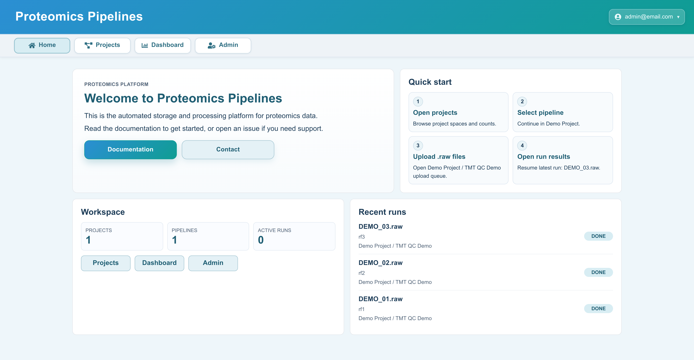

[](https://github.com/LewisResearchGroup/LAMPrEY/pkgs/container/lamprey)
[](https://lewisresearchgroup.github.io/LAMPrEY/getting-started/)
[](https://deepwiki.com/LewisResearchGroup/LAMPrEY)
[](https://github.com/LewisResearchGroup/LAMPrEY/issues)

<p align="center">
  
</p>

# LAMPrEY

LAMPrEY (**L**arge-scale **A**utomated **M**ulti-level **Pr**oteomics **E**valuation by P**y**thon) is a Docker-based quality control pipeline server for quantitative proteomics. It is designed for laboratories that want to organize proteomics pipelines, process RAW files automatically, and review QC results through a web interface.

Full documentation: [LAMPrEY documentation](https://LewisResearchGroup.github.io/LAMPrEY/)



## What It Provides

- project and pipeline management through the Django admin
- automated RAW file processing with [MaxQuant](https://maxquant.org/) and [RawTools](https://github.com/kevinkovalchik/RawTools)
- upload queue and per-run job management from the pipeline page
- an interactive QC dashboard with project, pipeline, and uploader filters
- an authenticated API for programmatic access

## Requirements

- Docker Engine
- Docker Compose, either `docker-compose` or `docker compose`
- `git-lfs`
- `make`

For full installation details, fallback setup paths, and troubleshooting, see the [Installation guide](https://LewisResearchGroup.github.io/LAMPrEY/installation/).

## Quick Start

Assuming you have the above requirements installed, you can get started with LAMPrEY in a few steps:

```bash
git lfs install
git clone git@github.com:LewisResearchGroup/LAMPrEY.git LAMPrEY
cd LAMPrEY
git lfs pull
./scripts/generate_config.sh
make init
make devel   # development server on http://127.0.0.1:8000
```

## Setup Modes

`make init` performs the first-time setup using the published container image:

- runs migrations
- prompts for a Django superuser
- collects static files
- bootstraps demo data

`make init-local` performs the same setup, but builds the image locally with `docker-compose-develop.yml`.

## Common Commands

```bash
make devel         # start the development stack on http://127.0.0.1:8000
make devel-build   # rebuild and start the development stack
make serve         # start the production-style stack
make down          # stop containers
make test          # run tests
```

## Notes

- Generated configuration is stored in `.env`.
- Local persistent data is stored under `./data/`.
- The admin panel is available at `/admin` after startup.
- The dashboard is available at `/dashboard` after login.
- Pipeline uploads and API requests are scoped to the authenticated user's projects.
- The bundled MaxQuant ZIP is stored with Git LFS.
- If `make` or `git-lfs` is missing, or if you need the local-build fallback (`make init-local`), use the installation guide.
- For installation details, admin usage, API documentation, and operational notes, see the documentation site.
