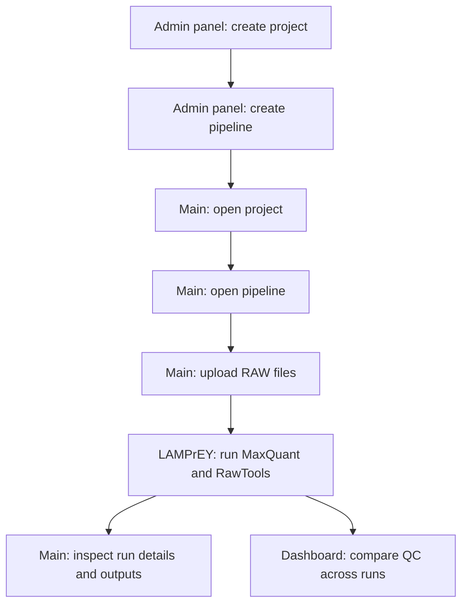

# Application

The **Application** section explains how people move through LAMPrEY once the platform is running.

At a high level, the workflow is:

1. an administrator creates a project and pipeline
2. a user opens the configured pipeline
3. the user uploads one or more `.raw` files
4. LAMPrEY processes each run with MaxQuant and RawTools
5. the user reviews run outputs in **Main** and compares QC in **Dashboard**

## Workflow overview

## How the Application section is organized

### Admin panel

Use the **Admin panel** pages for one-time setup and configuration tasks:

- create users
- create projects
- prepare and upload `mqpar.xml`
- create pipelines

This is the setup layer that makes the rest of the application usable.

### Main

Use **Main** for operational work:

- browse projects
- open pipelines
- upload `.raw` files
- monitor queue and run state
- inspect individual run outputs

This is where most day-to-day submission and run tracking happens.

### Dashboard

Use **Dashboard** after runs have completed:

- review QC plots
- compare metrics across runs
- spot outliers and trends

This is the analysis layer for cross-run quality review.

## Suggested reading order

If you are new to the application, read these pages in order:

1. [Admin panel overview](how-to-access-the-admin-panel.md)
2. [How to add a project](how-to-add-a-project.md)
3. [How to prepare `mqpar.xml`](how-to-prepare-mqpar.md)
4. [How to add a pipeline](how-to-add-a-pipeline.md)
5. [How to submit RAW files](how-to-submit-raw-files.md)
6. [Main](main.md)
7. [Dashboard](dashboard.md)
