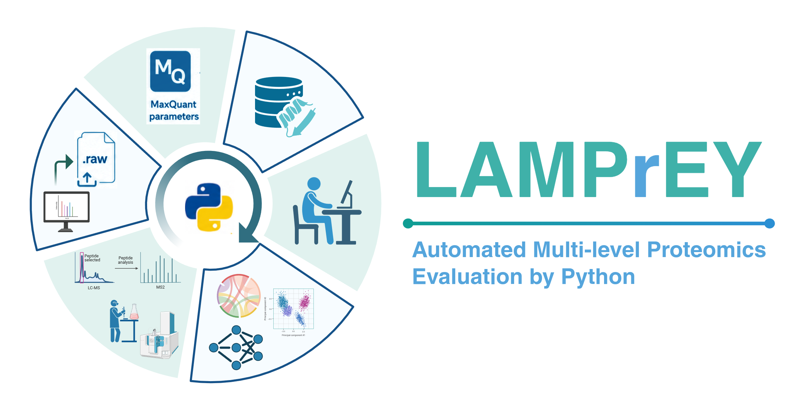

# Getting started

LAMPrEY (**L**arge-scale **A**utomated **M**ulti-level **Pr**oteomics **E**valuation by P**y**thon) is a comprehensive quality-control pipeline for large-cohort quantitative proteomics, featuring GUI-based file submission, automated processing with MaxQuant and RawTools, and an interactive analytics dashboard, as well as an application programming interface (API) for programmatic usage and extensibility.

LAMPrEY's graphical user interface consists of three integrated components:

- The Admin space for project and pipelines configuration
- The Main section for file submission and run tracking
- The interactive Dashboard for data exploration.

    
This architecture separates project configuration, data processing, and quality-control analysis, enabling reproducible processing of large proteomics cohorts through centralized control of pipelines configurations, software versions and analysis parameters. 

## Choose your path

### Explore first

If you want a quick tour of the platform and seeded example data, go to the [demo guide](demo.md).

This is the best path if you want to:

- understand the main workflow
- see what projects, pipelines, and run results look like

### Install LAMPrEY

If you are ready to set up your own environment, continue to the [installation guide](installation.md) to:

- run LAMPrEY locally
- configure dependencies and services
- create a working development or deployment setup

## What comes after installation

Once installation is complete, the usual next steps are:

1. Open the [admin panel guide](how-to-access-the-admin-panel.md).
2. [Add a user](how-to-add-a-user.md).
3. [Create a project](how-to-add-a-project.md).
4. [Create a pipeline](how-to-add-a-pipeline.md).
5. [Submit RAW files](how-to-submit-raw-files.md).
