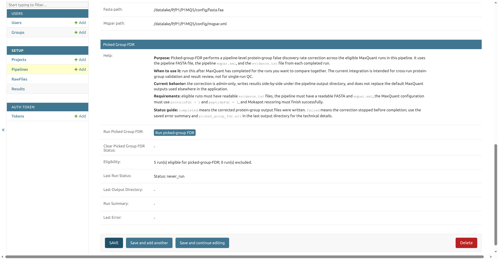

## Why Picked Protein Group FDR correction?

LAMPrEY processes each RAW file independently through MaxQuant, and the resulting protein groups are filtered by MaxQuant's internal FDR estimation, usually at the 1% level. This approach should work for one or few runs, but as the pipeline starts to accumulate runs, naively compiling lists of identified proteins by combining large numbers of experiments leads to loss of control of the protein FDR (inflated FDR).

Picked Protein Group FDR is a method developed by The, Samaras, Kuster, and Wilhelm in [Reanalysis of ProteomicsDB Using an Accurate, Sensitive, and Scalable False Discovery Rate Estimation Approach for Protein Groups](https://pmc.ncbi.nlm.nih.gov/articles/PMC9718969/) for calculating protein group-level FDR. The method correctly controls protein group-level FDR, while scaling well to large datasets. The accompanying tool can be applied natively to MaxQuant search results, with the option of combining multiple search results in a single protein group analysis.

## When to use it

In LAMPrEY, this is not part of the normal upload step. It is a manual admin action on an existing pipeline. Run it after the pipeline has been created and MaxQuant has completed for the runs for which we want to control the FDR.

Use this action when:

- the pipeline has multiple completed MaxQuant runs that belong to the same biological or technical comparison
- you want downstream QC and protein-group review to use a pipeline-level corrected protein set
- the pipeline was configured for this workflow by setting both `proteinFdr = 1` and `peptideFdr = 1` in `mqpar.xml`

Do not use this action as a replacement for checking whether individual MaxQuant runs finished successfully. Runs without completed MaxQuant output or readable `evidence.txt` files are excluded from the picked-group FDR task.

## Requirements

- eligible runs must have readable `evidence.txt` files
- the pipeline must have a readable `FASTA` file and `mqpar.xml`
- the MaxQuant configuration must use `proteinFdr = 1` and `peptideFdr = 1`
- Mokapot rescoring must finish successfully

## Run the action

To run it:

1. Open the Django admin panel.
2. Open the pipeline from **Setup > Pipelines**.
3. Find the **Picked Group FDR** section.
4. Review the **Eligibility** and **Last Run Status** fields.
5. Click **Run picked-group FDR**.

The action queues a background task for the eligible completed MaxQuant runs in that pipeline. While the task is queued or running, the button is replaced with a status message. When the task finishes, the same pipeline admin page shows the last status, output directory, run summary, and any saved error message.

## Status guide

- `never_run`: picked-group FDR has not been requested for this pipeline
- `requested` or `running`: the task has been queued or is still in progress
- `completed`: corrected protein-group output files were written
- `failed`: the correction stopped before completion; check **Last Error** and `picked_group_fdr.err` in the last output directory

If you remove picked-group FDR output files manually, the admin page can still show the previous status and run summary because those fields are stored on the pipeline database record. Use **Clear picked-group FDR status** to reset the stored task ID, status, last run directory, manifest, and error message. This does not delete output files.

## Current behavior

The correction is admin-only, writes results side-by-side under the pipeline output directory, and does not replace the default MaxQuant output files.

Successful runs write pipeline-level picked-group FDR outputs such as `proteinGroups.fdr1.txt`. LAMPrEY also writes per-run protein-group files so downstream QC and protein-group views can use the corrected protein set when a completed picked-group FDR run is available.
